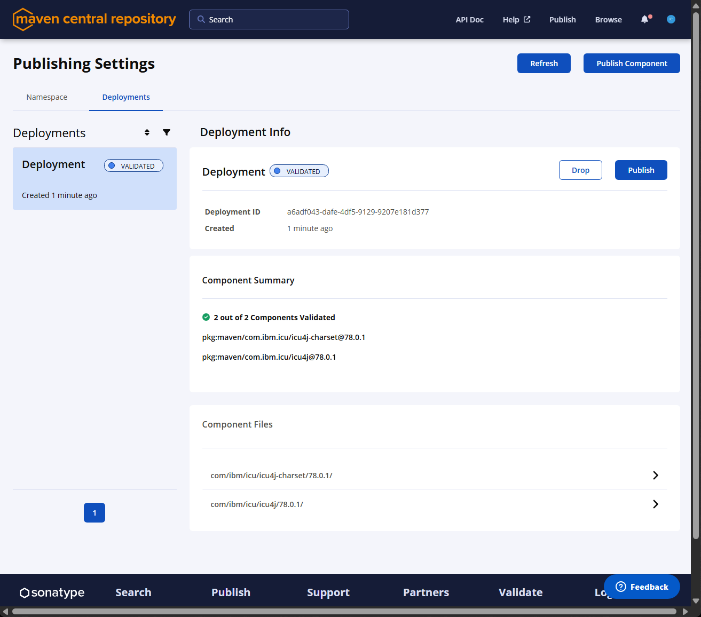
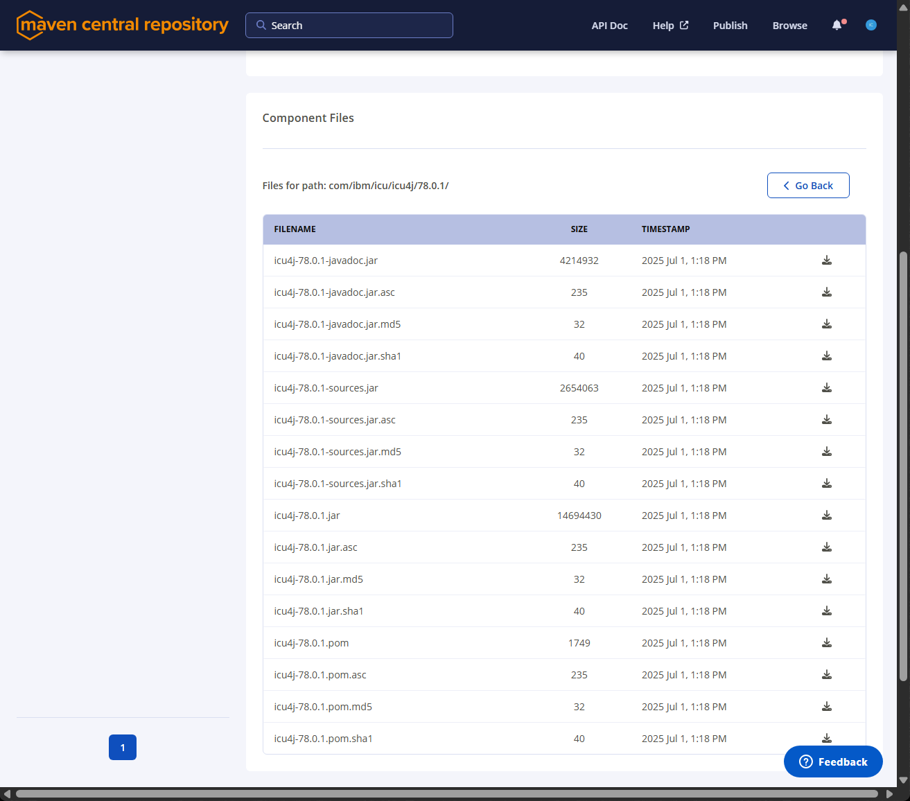

<!--
© 2024 and later: Unicode, Inc. and others.
License & terms of use: http://www.unicode.org/copyright.html
-->

# Publish - Version 76.1 - WIP
{: .no_toc }

## Contents
{: .no_toc .text-delta }

---

## Most artifacts are now built in the GitHub CI. Work in Progress!!!

Many of the tasks that used to be done before "by hand" are now at least
partially done by GitHub Actions.

The release requires (for now) triggering the actions "by hand".

First go to [Github - unicode-org/icu](https://github.com/unicode-org/icu).

Create a release, give it a tag (something like `release-76` or `release-74-2`) \
Make sure the release is **DRAFT**.

See [Release & Milestone Tasks - Tagging](index.md#tagging) for details.

That tag will need to be passed to several of the actions below.

Go to [Github - unicode-org/icu](https://github.com/unicode-org/icu) -- Actions
and select the action to run from the left side.

Select an action and (from the right side) select "Run workflow".

Some actions will have an "Run the tests." option. \
**KEEP IT ON!** It is there for development, but you MUST run the tests for release.

Most will have a "Release tag to upload to." option. \
Here you should use the release tag.

1. **GHA ICU4C** \
   This will create and add to release: \
   * The Windows binaries (`icu4c-{icuver}-Win32-MSVC20??.zip`,
   `icu4c-{icuver}-Win64-MSVC20??.zip`, `icu4c-{icuver}-WinARM64-MSVC20??.zip`)
   * The packaged data for ICU4X (`icuexportdata_tag-goes-here.zip`)

1. **Release - ICU4C artifacts on Fedora** (`release-icu4c-fedora.yml`) \
   This will create and add to release:
   * `icu4c-{icuver}-Fedora_Linux??-x64.tgz`.

1. **Release - ICU4C artifacts on Ubuntu** (`release-icu4c-ubuntu.yml`) \
   This will create and add to release:
   * The `icu4c-{icuver}-Ubuntu??.04-x64.tgz` file
   * The icu4c data files (`icu4c-{icuver}-data.zip`,
     `icu4c-{icuver}-data-bin-b.zip`, `icu4c-{icuver}-data-bin-l.zip`)
   * The icu4c source archives (`icu4c-{icuver}-src.tgz` and `icu4c-{icuver}-src.zip`)
   * The ICU4C documentation (`icu4c-{icuver}-docs.zip`) \
   **WARNING:** this is also the one to be published (unpacked) for web access

1. **Release - ICU4J publish to Maven Central** (`release-icu4j-maven.yml`) \
   This will create, publish to Maven Cental (using Sonatype), and add to release:
   * All the official Maven artifacts, including sources and javadoc. \
     The Maven Central artifacts have checksums and are digitally signed. \
     Someone with access to Sonatype Nexus should still login there and authorize
     the promotion to Maven Central.
   * The unified Java documentation, (`icu4j-76.1-fulljavadoc.jar`) \
     **WARNING:** this is also the one to be published (unpacked) for web access
   * Make sure to set the proper parameters:
     * **Branch:** the branch prepared for release, for example `maint/maint-77`
     * **Run the tests:** checked (default)
     * **Deploy to Maven Central:** check (unchecked by default), if you are ready
       for a real deployment and not doing just a sanity check
     * **Release tag to upload to:** should be the GitHub draft release prepared
       in a previous BRS step.

1. **Release - Create checksums and GPG sign** (`release-check-sign.yml`) \
   THIS SHOULD BE THE LAST ACTION YOU RUN. \
   After all the artifacts from the previous steps are posted to the release. \
   The action will download all the artifacts from release,
   create checksum files (`SHASUM512.txt` and `*.md5`),
   and digital signature files (`*.asc`)

1. **Login to Sonatype, sanity check, and approve** \
  The previous step stages the Maven artifacts to Sonatype, but does
  not automatically push them to Maven Central. \
  It can be enabled, but we chose no to enable it by default so that a human can do a last sanity check. \
  So someone must login to Sonatype, check that everything looks fine, and approve. \
  <b>Note:</b> only someone with a Sonatype account
  that was authorized for `com.ibm.icu` can approve. \
  You can find the list of people with such access in the team shared folder. \
  To do that:
    * log on to the [Sonatype Central Portal -- Namespaces](https://central.sonatype.com/publishing/namespaces).
    * Select the **Deployments** tab.
      
    * Check the files staged there (`icu4j-charset` is similar):
      
    * Compare to a previous public release in Maven Central
    (for example [ICU4J 77.1](https://repo1.maven.org/maven2/com/ibm/icu/icu4j/77.1/)
    and [ICU4J Charset 77.1](https://repo1.maven.org/maven2/com/ibm/icu/icu4j-charset/77.1/)) \
    And do a sanity check:
      * make sure there are no errors / warnings
      * the timestamps look reasonable
        (close to the time when the ICU4J publish GitHub action finished),
      * the version is the one you expect to release
      * the file sizes didn't drastically change from the previous release
    * Once you confirm that everything looks reasonable, approve the deployment
      (click **Publish**).
